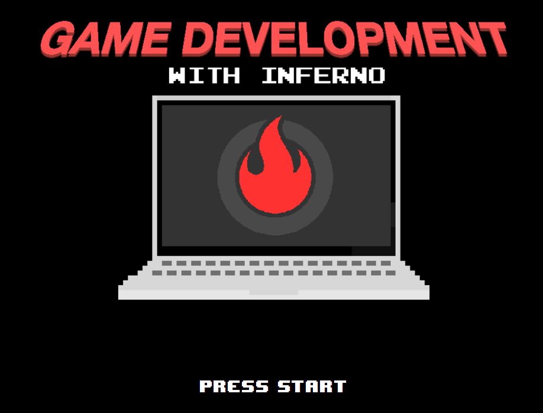

# inferno-game-kit

## A fork of react-game-kit using Inferno (1.0.0-alpha11) instead of React.



This is just a fork of [react-game-kit](https://github.com/FormidableLabs/react-game-kit) where React has been aliased as [Inferno](https://github.com/trueadm/inferno).  

Simply by swapping out React for Inferno, the following was achieved:
* 255kb → 65kb
* -40% CPU time
* -25% memory

There is currently some sort of bug with npm & the dependencies. To get past this, just follow the instructions below in the order they are listed.

Instructions:

```
git clone https://github.com/joshburgess/inferno-game-kit
&& cd inferno-game-kit
&& npm i -D babel-plugin-inferno@1.0.0-alpha11
&& npm i -S inferno@1.0.0-alpha11 inferno-compat@1.0.0-alpha11
&& npm i
```
Then,
```
npm start
```
and open localhost:3000 in your browser.
